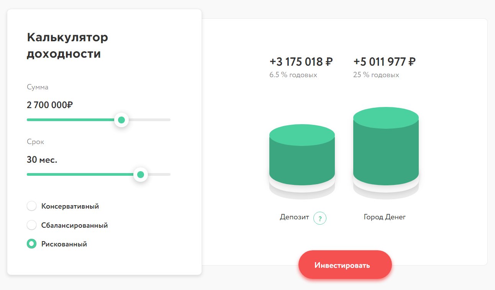

# Калькулятор доходности
#### Производит рассчёт по вкладам с ежемесячной капитализацией

### Формула для рассчёта
## Д = С * (1 + Р/12)^Т

* Д - доходность
* С - сумма
* Р – размер годовой процентной ставки
* Т – на сколько месяцев открыт вклад

### В проекте используются
* HTML
* CSS
* Java Script

### Проект выполнен [Надеждой Никишиной](https://github.com/NadyaNikishina)
